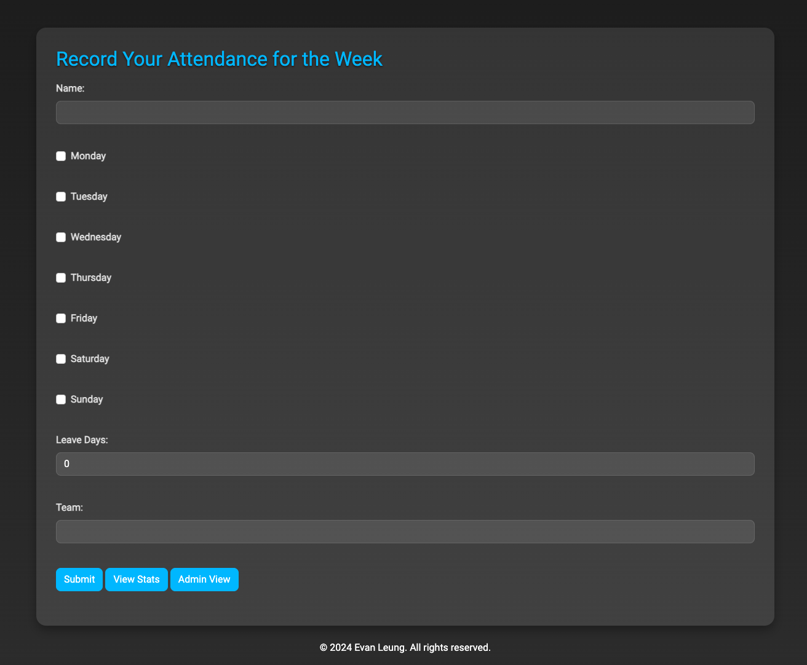

# 简易员工考勤记录系统
> 因为公司需要员工每个月需要满足40%回公司出勤率。但由于团队成员不一定都是按照Pod day回到公司，团队管理人员并没有很有的方式得知员工真实的出勤天数，为了方便记录大家回到公司的天数而开发的小应用，主要功能如下:

>1.输入操作:员工可以填写每周哪几天回公司、请假天数以及员工名称
>
>2.统计数据:员工可以查看自己回到公司多少天、还差多少天达标、达标率(默认40%出勤率达标)
> 

# 操作界面

## 输入界面

## 统计界面
